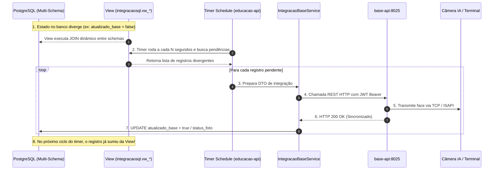

O ecossistema divide as responsabilidades centrais entre duas grandes APIs executáveis:
- **`educacao-api` (porta 8021):** Módulo de negócio educacional (alunos, matrículas, turmas, quadro de horários, presenças e Busca Ativa).
- **`base-api` (porta 8025):** Módulo de hardware e infraestrutura (câmeras faciais, terminais de ônibus, Netty TCP, sincronia FDLib e streaming CFTV).

Ambos compartilham o mesmo cluster **PostgreSQL 16** com múltiplos schemas (`base`, `alunopresente`, `cadastro`, `storage`, `auth`, `integracaosql`). 

Para garantir alto desempenho, desacoplamento e consistência de dados, a comunicação entre eles segue regras arquiteturais rigorosas que determinam **quando utilizar requisições HTTP REST síncronas** e **quando utilizar Views SQL com jobs em background**.

---

## 🧭 Matriz de Decisão: REST HTTP vs. View SQL

A escolha do canal de integração não é arbitrária — segue uma matriz técnica baseada em **natureza da operação, latência exigida, volume de dados e acoplamento de hardware**:

| Critério de Avaliação | Usar Integração por REST HTTP (`RestTemplate`) | Usar Integração por View SQL (`integracaosql`) |
|---|---|---|
| **Natureza da Operação** | Comandos com efeito colateral, disparos para hardware ou upload de binários/mídia. | Reconciliação em lote, auditoria de integridade e cruzamento referencial. |
| **Volume de Dados** | Registros individuais ou pequenos lotes (1 a 50 itens por chamada). | Alto volume / conjuntos massivos (centenas a dezenas de milhares de registros). |
| **Acoplamento** | Síncrono (requisição / resposta com status HTTP 2xx/4xx/5xx). | Assíncrono e desacoplado em nível de dados (PostgreSQL JOIN otimizado). |
| **Trânsito de Mídia** | **Obrigatório para arquivos:** Multipart upload de fotos JPEG/PNG. | **Proibido para blobs:** Views transitam apenas metadados, paths e IDs. |
| **Ação em Hardware** | Dispara comando imediato de sincronização de template na memória da câmera. | Não toca diretamente no hardware; apenas expõe discrepâncias para schedules. |
| **Exemplo Típico** | `POST /api/faces/incluirFaceUpload-integracao` | `SELECT ... FROM integracaosql.vw_ap_unidades_para_inserir_no_base` |

### 1. Quando Fazer Integração por Requisição (REST HTTP)

A integração via HTTP REST síncrono é realizada pela classe [`IntegracaoBaseService`](file:///home/alisson/projetos/laboratorio-aplicacao-java/alunopresente-service/src/main/java/br/com/alunopresenteservice/domain/integracao/service/IntegracaoBaseService.java) dentro de `alunopresente-service` consumindo a porta `8025` de `base-api`.

Deve ser utilizada **obrigatoriamente** nos seguintes cenários:

1. **Upload e Distribuição de Arquivos Binários (Fotos dos Alunos):**
   * O banco de dados relacional não deve ser saturado com transporte de payloads multipart pesados. O envio da foto do aluno cadastrado no portal web para persistência no `storage` e processamento biométrico ocorre via `POST /api/faces/incluirFaceUpload-integracao`.
2. **Comandos com Efeito Colateral em Dispositivos Físicos:**
   * Quando a operação exige acionamento de hardware em tempo hábil (ex: notificar o `base-api` para injetar a foto na lista branca/FDLib das câmeras da escola ou enviar comando de reboot/manutenção).
3. **Expurgo Físico de Memória nas Câmeras (Remoção Total):**
   * Quando um aluno é transferido, cancelado ou formado, as câmeras físicas precisam apagar a face de suas memórias internas por compliance de segurança e LGPD. O comando de remoção é disparado via `POST /api/faces/marcarParaRemocaoTotal`.
4. **Vínculos Dinâmicos com Feedback Imediato:**
   * Vinculação de uma face já existente no Base a uma nova Unidade Escolar ou Ônibus via `POST /api/faces/incluirFaceUnidade-integracao`.

### 2. Quando Fazer Integração por View SQL (`integracaosql`)

O módulo dedicado [`integracao-sql`](file:///home/alisson/projetos/laboratorio-aplicacao-java/integracao-sql/) gerencia migrações Flyway que criam views no schema `integracaosql`. Essas views executam `JOIN`s entre as tabelas dos schemas `alunopresente` e `base`.

Deve ser utilizada **obrigatoriamente** nos seguintes cenários:

1. **Detecção de Divergências de Estado (Reconciliação Contínua):**
   * Identificar alunos cuja foto falhou na câmera (`vw_ap_alunos_com_status_divergente_da_face_falha`) ou teve sucesso (`vw_ap_alunos_com_status_divergente_da_face_sucesso`) sem necessidade de polling HTTP endpoint a endpoint.
2. **Filas Naturais de Processamento (Batch Queues):**
   * Descobrir registros pendentes de sincronização através de filtros simples em tempo real, como `vw_ap_face_nao_vinculado_no_base` (`WHERE atualizado_base IS FALSE`).
3. **Migrações e Cargas em Massa de Alto Throughput (Zero Network Overhead):**
   * Inserir escolas e veículos diretamente no schema `base` executando SQL puro entre schemas (`INSERT INTO base.tb_unidade SELECT ... FROM integracaosql.vw_ap_unidades_para_inserir_no_base ON CONFLICT DO NOTHING`), eliminando serialização JSON e tráfego de rede entre processos.
4. **Agregações Analíticas e Cruzamentos de Presença/Alimentação:**
   * Cruzar os eventos biométricos de refeitório registrados por hardware em `base.tb_evento_tratado` com as turmas e matrículas em `alunopresente.tb_matricula` para consolidação dos relatórios de refeições.

---

## 🔄 O Padrão de Loop Fechado (Closed-Loop Sync)

Na prática, o sistema combina **Views SQL**, **Schedules** e **Requisições REST** em um padrão elegante de arquitetura resiliente e autorreparável:

---

## ⏰ Mapeamento das Schedules e Timers de Sincronização

A orquestração das chamadas aos dois canais é controlada centralmente pela classe [`ConfiguracaoTimerAlunoPresenteBaseService.java`](file:///home/alisson/projetos/laboratorio-aplicacao-java/educacao-api/src/main/java/br/com/educacao/timers/ConfiguracaoTimerAlunoPresenteBaseService.java) no `educacao-api`.

Cada timer utiliza travas atômicas (`AtomicBoolean` ou `ConcurrentHashMap`) para garantir que uma execução demorada **nunca gere concorrência ou sobreposição de lotes**.

### Tabela de Schedules no `educacao-api`

| Método Agendado | Frequência (`fixedDelay`) | View SQL / Repositório | Ação Executada & Canal Utilizado |
|---|---|---|---|
| `enviarFotosParaObase()` | **20 segundos** (`20_000`) | `integracaosql.vw_ap_face_nao_vinculado_no_base` | Busca alunos com foto que estão com `atualizado_base = false`. Para cada um, executa **REST** `POST /api/faces/incluirFaceUpload-integracao`. Ao receber 200, marca `atualizado_base = true`. |
| `envioVinculoUnidadeEscolarAluno()` | **20 segundos** (`20_000`) | `IAlunoUnidadeEscolarRepository` | Envia o vínculo da matrícula do aluno com a Unidade Escolar para o Base via **REST** `POST /api/faces/incluirFaceUnidade-integracao`. |
| `enviarFotosParaOsVeiculos()` | **20 segundos** (`20_000`) | `AlunoVeiculoEscolarService` | Vincula a face do aluno ao validador facial do ônibus escolar específico via **REST**. |
| `marcarFotosDaUnidadeEscolarParaReenvioPeloStatusDaUnidade()` | **25 segundos** (`25_000`) | `integracaosql.vw_ap_unidades_escolares_sem_faces_base` | Identifica unidades onde `controle_faces = 'AGUARDANDO_ENVIO_DAS_FACES'`, redefine os alunos para reenvio (`atualizado_base = false`) e muda o controle da escola para `MANTER`. |
| `marcarFotosDoVeiculoEscolarParaReenvioPeloStatusDaUnidade()` | **25 segundos** (`25_000`) | `integracaosql.vw_ap_veiculos_escolares_sem_faces_base` | Identifica veículos escolares que precisam de sincronização completa de faces e agenda a retransmissão dos lotes. |
| `sincronizarCondicaoOperacional()` | **30 segundos** (`30_000`) | `unidadeEscolarRepository.sincronizarCondicaoOperacionalComOSistemaBase()` | Atualiza a condição operacional (ATIVO / DESATIVADO) entre a tabela física `base.tb_unidade` e a `alunopresente.tb_unidade_escolar` via **SQL Cross-Schema**. |
| `cadastrarUnidadesNaoCadastradas()` | **60 segundos** (`60_000`) | `integracaosql.vw_ap_unidades_para_inserir_no_base` | Executa `INSERT INTO base.tb_unidade SELECT ... FROM integracaosql.vw_ap_unidades_para_inserir_no_base ON CONFLICT DO NOTHING` via **SQL Cross-Schema direto**. |
| `cadastrarVeiculosNaoCadastrados()` | **60 segundos** (`60_000`) | `IVeiculoRepository.cadastrarVeiculosNaoCadastradosNoBase()` | Insere novos ônibus cadastrados no transporte escolar na tabela `base.tb_unidade` como unidades móveis com `tipo_unidade_id = 'Transporte Escolar'`. |
| `scheduleAtualizacaoStatusAlunos()` | **120 segundos** (`120_000`) | `integracaosql.vw_ap_alunos_com_status_divergente_da_face_falha` e `..._sucesso` | Lê o status real da sincronia de cada face nas câmeras (`base.tb_biblioteca_face_sincronia`) e atualiza o campo `status_foto` do aluno no schema `alunopresente` para `FALHA` ou `SUCESSO`. |
| `marcarFotosParaRemocaoCompletaNoBase()` | **60 segundos** (`60_000`) | `RemocaoCompletaFotoAlunoService` | Coleta alunos desvinculados ou marcados para exclusão e notifica o Base via **REST** `POST /api/faces/marcarParaRemocaoTotal`. |
| `verificarSeFacesMarcadasParaRemocaoForamRemovidasBase()` | **10 minutos** (`600_000`) | `RemocaoCompletaFotoAlunoService` | Consulta o status no Base para auditar se os dispositivos de campo já confirmaram o expurgo físico das memórias locais. |
| `executarExclusaoDoRegistrosDeFacesTotalmenteRemovidas()` | **60 segundos** (`60_000`) | `RemocaoCompletaFotoAlunoService` | Após a confirmação física de expurgo pelas câmeras, limpa os registros lógicos e vínculos no schema `alunopresente`. |
| `enviarEventosRefeicao()` | **60 segundos** (`60_000`) | `EventoAlunoRefeicaoRedisService` | Drena eventos de refeição cacheados no Redis e sincroniza o quadro de consumo alimentar das unidades escolares ativas. |

---

### Schedules Complementares no `base-api`

Do lado do **`base-api`**, a classe [`ConfiguracaoTimerService.java`](file:///home/alisson/projetos/laboratorio-aplicacao-java/base-api/src/main/java/br/com/base/timers/ConfiguracaoTimerService.java) e os jobs do Spring Batch processam a ponta final com os equipamentos físicos:

* **`EnviarFotoBatchConfig` (a cada 60s):** Pega as faces registradas no `base` e despacha para as bibliotecas das câmeras através dos protocolos ISAPI/TCP do fabricante.
* **`RemocaoCompletaFaceBatchConfig` (a cada 1h):** Executa a limpeza física em lote nas câmeras para manter as listas brancas enxutas e dentro dos limites de hardware (NPU/FDLib).
* **Buffers de Eventos (a cada 5s):** [`EventoTratadoBufferService`](file:///home/alisson/projetos/laboratorio-aplicacao-java/base-service/src/main/java/br/com/baseservice/domain/buffer/EventoTratadoBufferService.java) e `EventoBufferService` gravam em lote no banco e publicam no RabbitMQ com alta performance e baixo lock.

---

## 🛡️ Regras de Ouro para Desenvolvedores

1. **Nunca crie dependência direta entre entidades JPA de schemas diferentes:** Entidades de `alunopresente` **nunca** devem mapear `@ManyToOne` para entidades de `base`. Use views no schema `integracaosql` ou chamadas de serviço via REST.
2. **Views SQL são apenas de leitura:** As views de `integracaosql` nunca devem ser alvo de `UPDATE` ou `INSERT` direto; alterações devem ocorrer nas tabelas canônicas de seus respectivos schemas.
3. **Respeite as travas atômicas em Timers:** Ao implementar novas rotinas em `ConfiguracaoTimerAlunoPresenteBaseService`, sempre encapsule a execução em um `AtomicBoolean.compareAndSet(false, true)` com bloco `try/finally` para evitar loops de processamento duplicado.
